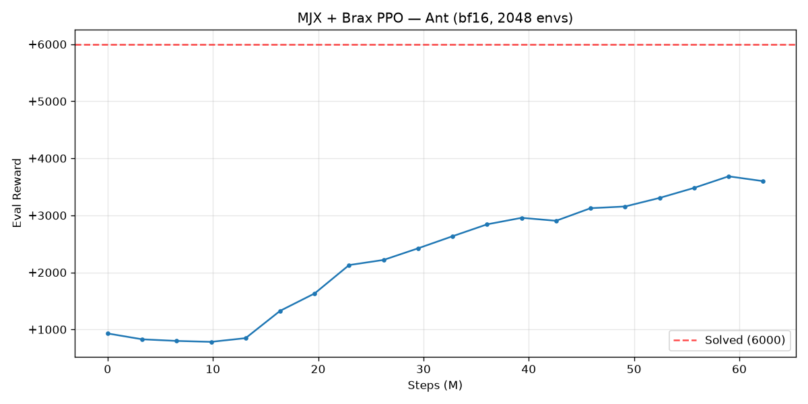

# G1-Rough-ROCm — Humanoid rough-terrain RL **on AMD GPUs**

> Train a **Unitree G1** humanoid to walk over rough terrain with massively-parallel GPU
> reinforcement learning — running on **AMD Radeon (ROCm / RDNA4)**, not just NVIDIA.


Almost every robot-learning stack assumes an NVIDIA GPU (Isaac Gym / Isaac Lab are CUDA-only).
This project is a clean, config-driven **MJX + Brax PPO** pipeline that trains GPU-accelerated
locomotion **on AMD hardware** — and ships with the ROCm landmines for the brand-new
**RDNA4 / gfx1201** already diagnosed and defused.

If you have an AMD card and want to do serious robot RL, this is a working starting point.

---

## ✨ Why this repo

- 🔴 **Runs on AMD ROCm.** Validated on a **Radeon AI PRO R9700 (gfx1201 / RDNA4, 32 GB)**.
  The AMD path for robot RL is barely documented — here it actually works, end to end.
- 🤖 **Unitree G1 rough-terrain locomotion** via [MuJoCo Playground](https://github.com/google-deepmind/mujoco_playground)
  (29-DoF humanoid, heightfield terrain, asymmetric actor-critic PPO).
- 🧠 **SimBa networks** ([ICLR 2025](https://arxiv.org/abs/2410.09754)) — residual + LayerNorm
  policy/value, a drop-in upgrade over plain MLP, selectable from config.
- 💾 **Crash-safe training** — periodic checkpoints, **TensorBoard** logging, and one-flag
  **resume** (`restore_path=`). No more losing an 8-hour run.
- 🎬 **Headless rendering** to mp4/gif (EGL), plus a comparison-friendly evaluation path.
- 🛠️ **Battle-tested gfx1201 workarounds** (see [AMD troubleshooting](#-amd--gfx1201-troubleshooting)) —
  the single most valuable thing here if you fight ROCm.

> Not your hardware? The exact same code runs on **NVIDIA (CUDA)** — just install the CUDA
> build of JAX instead (one line, see install). On NVIDIA you can also crank `num_envs` and
> turn domain randomization back on.

---

## 📊 Results

Unitree G1, `G1JoystickRoughTerrain`, PPO. Reward is per-episode tracking reward (higher = better gait).

<!-- RESULTS:START -->
| Run | Network | Steps | Eval reward | steps/s |
|-----|---------|-------|-------------|---------|
| Baseline | MLP (512,256,128) | 100 M | **+11.9** ± 8.1 | 4549 |
| SimBa (no DR) | SimBa 2×256/512 | 150 M | **+21.7** ± 9.9 | 5521 |
| MLP + DR | MLP + domain rand. | 150 M | **+11.8** ± 9.8 | 7400 |
| SimBa big | SimBa 3×384/512 | 150 M | **+24.4** ± 8.0 | 4456 |
| simba_cont1 | SimBa (resumed) | 50 M | **+24.2** ± 9.1 | 4644 |

_Best policy: **SimBa big** (eval reward +24.4). Single Radeon AI PRO R9700 (gfx1201), 1024 envs._


<!-- RESULTS:END -->

> Results table and demo above are auto-updated when the experiment queue finishes.

---

## 🖥️ Hardware & software

| | |
|---|---|
| **GPU (AMD)** | RDNA3/RDNA4, ROCm-supported. Tested: Radeon AI PRO R9700 (gfx1201), 32 GB, **ROCm 7.2.4** |
| **GPU (NVIDIA)** | any CUDA 12 GPU (use the CUDA JAX build) |
| **OS / Python** | Linux, Python 3.12 |
| **Key stack** | JAX 0.9.2 · jaxlib 0.9.2 · Brax 0.14.2 · MuJoCo/MJX 3.10 · mujoco_playground 0.2.0 · Flax · Optax |

---

## 🚀 Installation

We use [`uv`](https://github.com/astral-sh/uv) (any venv tool works).

```bash
git clone <this-repo> && cd <this-repo>
uv venv --python 3.12 .venv-mjx
VIRTUAL_ENV=.venv-mjx uv pip install -r requirements-mjx.txt
```

Then install the **JAX backend** for your GPU:

```bash
# AMD ROCm (gfx1201/RDNA4) — these self-contained wheels fix the gfx1201 codegen bugs.
#   ⚠️ Use 0.9.2: jax 0.10.x drops device_put_replicated and breaks Brax 0.14.2.
VIRTUAL_ENV=.venv-mjx uv pip install \
    jax==0.9.2 jaxlib==0.9.2 jax-rocm7-pjrt==0.9.2 jax-rocm7-plugin==0.9.2

# --- OR --- NVIDIA CUDA 12
VIRTUAL_ENV=.venv-mjx uv pip install "jax[cuda12]==0.9.2"
```

`rocm_setup.py` sets the ROCm env-vars (HIP bitcode path, command-buffer off) automatically —
it is imported before JAX at every entry point, so you don't configure anything by hand.

Sanity check:

```bash
.venv-mjx/bin/python -c "import rocm_setup; rocm_setup.configure_rocm_runtime(); import jax; print(jax.devices())"
# -> [RocmDevice(id=0)]
```

---

## ⚡ Quickstart

```bash
# Train G1 rough-terrain (SimBa, checkpoints + TensorBoard auto-enabled)
.venv-mjx/bin/python train.py --config configs/g1_rough.yaml

# Watch it live
.venv-mjx/bin/python -m tensorboard.main --logdir runs      # http://localhost:6006

# Render the trained policy to video
.venv-mjx/bin/python src/utils/render_playground.py pipeline_g1_simba.pkl --x_vel 1.0

# Resume from the latest checkpoint (e.g. after an interruption)
.venv-mjx/bin/python train.py --config configs/g1_rough.yaml \
    restore_path=runs/<run_name>/checkpoints/latest.pkl
```

Override anything from the CLI (OmegaConf):

```bash
.venv-mjx/bin/python train.py --config configs/g1_rough.yaml \
    ppo.network=mlp ppo.domain_randomization=true ppo.num_timesteps=50_000_000
```

A pretrained walking policy (`pipeline_g1_rough.pkl`) is included so you can render immediately.

---

## ⚙️ Configuration (key options)

`configs/g1_rough.yaml` (all overridable on the CLI):

| Key | Meaning |
|-----|---------|
| `env` / `backend` | `G1JoystickRoughTerrain` / `playground` |
| `ppo.network` | `simba` (residual+LayerNorm) or `mlp` |
| `ppo.domain_randomization` | sim-to-real robustness (see AMD note) |
| `ppo.num_envs` | parallel envs (1024 validated on gfx1201; 8192 on NVIDIA) |
| `ppo.num_timesteps` / `num_evals` | budget / eval+checkpoint frequency |
| `restore_path` | resume / fine-tune from a saved `.pkl` |
| `naconmax` | contact buffer size (0 = env default) |
| `tensorboard` / `checkpoint` | toggle logging / checkpointing |

---

## 🔴 AMD / gfx1201 troubleshooting

The hard-won part. If you're fighting ROCm on RDNA4, read this.

- **`ROCM_ERROR_ILLEGAL_ADDRESS` during training, fine on CPU.**
  It's a gfx1201 codegen bug, not your code. **Upgrade to `jax-rocm 0.9.2`** — it fixes the
  force-sensor / domain-randomization / large-`num_envs` crashes we hit on 0.8.2.
  (Do **not** jump to 0.10.x: it removes `device_put_replicated`, which Brax 0.14.2 still uses.)
- **`xtile_compiler.cc … transpose` E-log during training.** Noisy but **non-fatal** — training
  continues.
- **SimBa + domain randomization aborts** with `MEMORY_APERTURE_VIOLATION` (even with reduced
  memory → it's codegen, not OOM). Each alone is fine. So: SimBa **or** DR, not both, on gfx1201.
  Default config uses SimBa without DR.
- **`num_envs` ceiling.** 1024 is the validated sweet spot here; 4096 OOMs the training graph.
  On NVIDIA you can go much higher.
- **GPU "wedge".** Killing a JAX process mid-run can leave the GPU in a state where small ops
  pass (a tiny matmul) but large workloads abort. Recovery: `sudo rocm-smi --gpureset -d 0`
  (or reboot). **Lesson: don't kill runs — that's why checkpointing every eval matters.**
- **Verify code without a GPU:** `JAX_PLATFORMS=cpu .venv-mjx/bin/python train.py ...` — the
  physics + training are correct on CPU; only the gfx1201 *compiler* is the variable.

More detail and the full diagnostic story: [`docs/amd-rocm-gfx1201.md`](docs/amd-rocm-gfx1201.md).

---

## 🧱 How it works

```
MuJoCo / MJX (JAX physics)         <- rigid-body sim, runs on AMD via ROCm
   └─ mujoco_playground             <- G1 rough-terrain env (obs/reward/terrain)
        └─ Brax PPO (this repo)     <- training loop, vmapped over 1024 envs
             ├─ PlaygroundPPOTrainer <- asymmetric actor-critic (policy: noisy state,
             │                          value: privileged state) + DR + resume
             ├─ SimBa / MLP networks <- src/algorithms/simba.py
             └─ runlog               <- run dir + checkpoints + TensorBoard
```

```
.
├── train.py                     # entry point (OmegaConf config + CLI overrides)
├── configs/g1_rough.yaml        # G1 rough-terrain config
├── src/
│   ├── config.py                # typed config (OmegaConf)
│   ├── envs.py                  # env factory (brax + playground backends + ROCm workarounds)
│   ├── runlog.py                # run folder, TensorBoard, periodic checkpoints
│   └── algorithms/
│       ├── base.py              # save/load (bundle format) + trainer interface
│       ├── ppo.py               # Brax PPO for standard brax envs
│       ├── ppo_playground.py    # G1/playground PPO (asymmetric critic, DR, resume)
│       └── simba.py             # SimBa network factory
│   └── utils/{render_mjx,render_playground,plot}.py
├── requirements-mjx.txt
├── run_queue.sh.example         # optional: chain experiments back-to-back, auto-commit
└── legacy/                      # earlier Gym + Stable-Baselines3 (PyTorch/CPU) experiments
```

---

## 🗺️ Roadmap

- [ ] More robots/tasks (Go1 quadruped, H1, flat-terrain baseline)
- [ ] Observation-history stacking (memory without an RNN)
- [ ] Domain randomization + SimBa together (blocked by a gfx1201 codegen bug — revisit on newer ROCm)
- [ ] Sim-to-real export / deployment notes
- [ ] CI smoke test (CPU backend)

---

## 🙏 Acknowledgements

- [MuJoCo Playground](https://github.com/google-deepmind/mujoco_playground) & [Brax](https://github.com/google/brax) (Google DeepMind)
- [MuJoCo / MJX](https://github.com/google-deepmind/mujoco)
- [SimBa: Simplicity Bias for Scaling Up Parameters in Deep RL](https://arxiv.org/abs/2410.09754) (ICLR 2025)
- AMD's [ROCm + JAX + MuJoCo guide](https://rocm.blogs.amd.com/artificial-intelligence/rocm-jax-mujoco/README.html)

## 📄 License

MIT — see [LICENSE](LICENSE).
